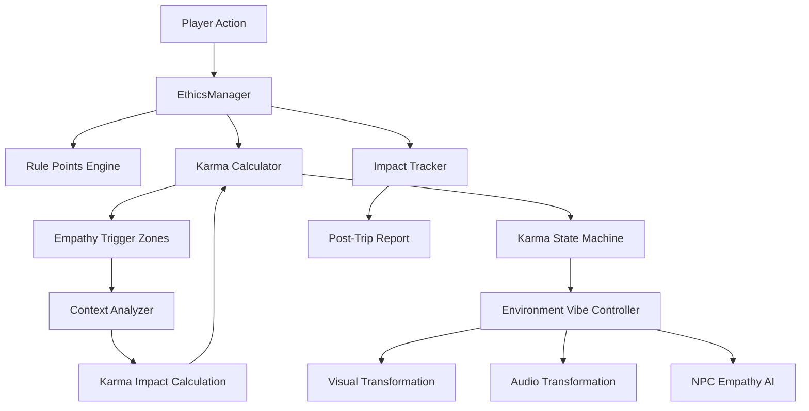

# 🚗 DriveWise: Complete Traffic Ethics & Rules Learning Game

## Product Requirements Document (PRD)

---

## 1. Executive Summary

**DriveWise** is a comprehensive, gamified driving education platform that transforms traditional traffic rule learning into an immersive 3D driving experience. Built on the foundation of an existing Unity WebGL traffic simulation, this project aims to be the **one-stop solution for traffic and road safety education**.

### Vision Statement
> "Making every learner a responsible driver through immersive, consequence-based learning"

### Core Philosophy
> **From "Fear of Fines" to "Pride in Skill and Harmony"**
> 
> DriveWise distinguishes between **Rules** (Legal compliance) and **Ethics** (The Social Contract/Empathy). We don't just teach how to avoid tickets—we cultivate drivers who make their communities proud to share the roads with them.

### Key Differentiators
| Traditional Learning | DriveWise |
|---------------------|-----------|
| Memorizing rule books | Learning through experience |
| Theory tests only | Interactive simulation |
| No real consequences | Realistic consequence system |
| Boring lectures | Gamified progression |
| One-time learning | Continuous skill building |

---

## 2. Problem Statement

### Current Challenges in Traffic Education
1. **High accident rates** among new drivers due to theoretical-only training
2. **Poor retention** of traffic rules learned through textbooks
3. **No safe environment** to practice real-world scenarios
4. **Lack of consequence awareness** - learners don't experience "what if"
5. **Expensive driving simulators** are inaccessible to most learners
6. **Inconsistent teaching** across driving schools

### Our Solution
A browser-accessible, gamified driving simulation that covers **every major traffic rule and road safety concept** through hands-on learning.

---

## 3. Target Audience

### Primary Users
| User Type | Description | Key Needs |
|-----------|-------------|-----------|
| **Pre-License Learners** | Ages 16-25 preparing for driving test | Full curriculum coverage, test preparation |
| **Driving School Students** | Enrolled in formal driving courses | Supplementary practice, progress tracking |
| **License Test Candidates** | About to take driving examination | Realistic scenarios, rule reinforcement |

### Secondary Users
| User Type | Description | Key Needs |
|-----------|-------------|-----------|
| **Driving Instructors** | Professional driving educators | Student tracking, curriculum tools |
| **Parents/Guardians** | Teaching teens to drive | Safe practice environment |
| **Refresher Learners** | Returning drivers/elderly | Updated rules, confidence building |
| **Schools/Institutions** | Road safety programs | Bulk access, reporting |

---

## 4. Comprehensive Traffic Rules Curriculum

> [!IMPORTANT]
> This game will cover ALL major traffic rules applicable in most countries, organized into learning modules.

### Module 1: Traffic Signals & Signs
#### 1.1 Traffic Light System
- **Red Light Rules**
  - Complete stop behind stop line
  - No right turn on red (unless specifically permitted)
  - Waiting at red light etiquette
  - Red light camera awareness
  
- **Yellow/Amber Light Rules**
  - Decision making: stop or proceed
  - Speed vs distance calculation
  - No acceleration through yellow
  
- **Green Light Rules**
  - Proceed when safe
  - Checking intersection before entering
  - Green arrow vs solid green difference
  
- **Flashing Signals**
  - Flashing red = stop sign
  - Flashing yellow = proceed with caution

#### 1.2 Road Signs Recognition
- **Regulatory Signs** (must obey)
  - Stop signs
  - Yield/Give way signs
  - Speed limit signs
  - No entry/One way
  - No parking/stopping
  - Weight/height restrictions
  
- **Warning Signs**
  - Curves ahead
  - Intersection warnings
  - Pedestrian crossing
  - School zone
  - Animal crossing
  - Road work ahead
  - Slippery road
  
- **Informational Signs**
  - Direction signs
  - Distance markers
  - Service area indicators
  - Lane guidance

#### 1.3 Road Markings
- Solid white line (no crossing)
- Broken white line (changing allowed)
- Double yellow line (no passing)
- Crosswalk markings
- Stop lines
- Turn lane arrows
- Bike lane markings

---

### Module 2: Right of Way Rules
#### 2.1 Intersection Rules
- Four-way stops (first to arrive = first to go)
- Uncontrolled intersections (yield to right)
- T-intersections (through traffic priority)
- Traffic circles/roundabouts (yield to traffic in circle)

#### 2.2 Pedestrian Priority
- Crosswalk yielding (always yield to pedestrians)
- School crossing zones
- Blind pedestrian right of way
- Jaywalker response protocols

#### 2.3 Emergency Vehicle Protocol
- Pull over and stop for ambulances
- Fire truck right of way
- Police vehicle response
- Do not follow emergency vehicles

#### 2.4 Special Priority Situations
- Funeral processions
- School buses (stop when lights flash)
- Public transport priority lanes
- Construction zone workers

---

### Module 3: Speed Management
#### 3.1 Speed Limits by Zone
| Zone Type | Typical Limit | Game Scenario |
|-----------|---------------|---------------|
| School Zone | 15-25 km/h | Active school hours simulation |
| Residential | 30-40 km/h | Neighborhood driving |
| Urban/City | 50-60 km/h | Downtown navigation |
| Suburban | 60-80 km/h | Mixed-use areas |
| Highway | 100-120 km/h | Expressway driving |
| Construction | As posted | Work zone navigation |

#### 3.2 Speed Adaptation
- Weather-based adjustment (rain, fog, snow)
- Visibility conditions (night, dusk)
- Road surface conditions (wet, icy)
- Traffic density response
- Curve speed management

---

### Module 4: Lane Discipline & Maneuvering
#### 4.1 Lane Rules
- Staying within lane markers
- Highway lane positioning (right lane for normal driving)
- Passing lane usage (left lane for overtaking only)
- Bus/HOV/Carpool lane rules
- Bike lane respect

#### 4.2 Lane Changing
- Mirror check sequence (inside → outside → blind spot)
- Signal activation (2-3 seconds before)
- Safe gap judgment
- Smooth transition
- Cancel signal after completion

#### 4.3 Overtaking/Passing
- Legal passing zones
- Illegal passing (solid lines, curves, hills)
- Safe passing distance
- Returning to lane safely
- No-passing zones emphasis

#### 4.4 Turning
- Proper positioning before turn
- Turn signal usage
- Right turns (stay in right lane)
- Left turns (yield to oncoming traffic)
- U-turn rules and restrictions

---

### Module 5: Parking & Stopping
#### 5.1 Parallel Parking
- Distance from curb (6-18 inches)
- Proper technique practice
- Hill parking (wheel positioning)

#### 5.2 Parking Rules
- No parking zones (fire hydrants, crosswalks)
- Disability parking rules
- Time-limited parking
- Residential permit zones
- Fire lane rules

#### 5.3 Stopping Rules
- Emergency stopping procedure
- Hazard light usage
- Safe stopping locations
- Bus stop zones
- Loading zones

---

### Module 6: Defensive Driving
#### 6.1 Following Distance
- 3-second rule in normal conditions
- 4+ seconds in adverse conditions
- Tailgating prevention
- Space management

#### 6.2 Scanning Techniques
- 12-15 second visual lead
- Mirror checking frequency
- Blind spot awareness
- 360-degree awareness

#### 6.3 Hazard Prediction
- Anticipating pedestrian behavior
- Reading other drivers' intentions
- Identifying road hazards
- Weather hazard recognition

#### 6.4 Collision Avoidance
- Emergency braking technique
- Evasive steering
- Recovery from skids
- Crash avoidance scenarios

---

### Module 7: Special Driving Conditions
#### 7.1 Night Driving
- Headlight usage rules
- High beam etiquette
- Reduced visibility adaptation
- Glare management

#### 7.2 Weather Conditions
- **Rain**: Hydroplaning prevention, increased following distance
- **Fog**: Low beam usage, reduced speed
- **Snow/Ice**: Traction management, gentle inputs
- **Wind**: Vehicle stability, high-profile vehicle awareness

#### 7.3 Highway/Expressway
- Merging procedures
- Exiting procedures
- Minimum speed requirements
- Lane discipline at high speeds
- Breakdown procedures

#### 7.4 Mountain/Hill Driving
- Uphill/downhill gear usage
- Brake fade prevention
- Runaway truck ramps
- Curve management

---

### Module 8: Vehicle Operation & Safety
#### 8.1 Pre-Drive Checks
- Mirror adjustment
- Seat belt usage (mandatory)
- Vehicle inspection routine
- Mirror-seat-belt sequence

#### 8.2 Signal Usage
- Turn signals (left/right)
- Hazard lights (when/when not to use)
- Horn usage (warning, not anger)
- Headlight/taillight control

#### 8.3 Dashboard Awareness
- Speed monitoring
- Fuel gauge awareness
- Warning light recognition
- Temperature monitoring

---

### Module 9: Legal & Ethical Responsibilities
#### 9.1 License Requirements
- Types of licenses
- Learner permit restrictions
- License renewal awareness

#### 9.2 Accident Procedures
- Stop at accident scene
- Call emergency services
- Exchange information
- Never flee the scene (hit and run consequences)

#### 9.3 DUI/DWI Awareness
- Zero tolerance messaging
- Impaired driving recognition
- Consequences simulation
- Designated driver concept

#### 9.4 Distracted Driving
- Cell phone usage dangers
- Passenger distraction
- Eating/drinking while driving
- Focus management

---

### Module 10: The Social Contract - Driving Ethics

> [!NOTE]
> **The Ethics Engine Philosophy**
> 
> While laws define the **minimum** acceptable behavior, **ethics defines excellence**. This module implements a parallel "Karma System" that tracks the invisible social contract between road users—the empathy, consideration, and harmony that transform chaotic streets into shared spaces.

#### 10.1 Rules vs Ethics: The Dual Reality

| Scenario | Legal Status | Ethical Status |
|----------|-------------|----------------|
| Splashing pedestrian with puddle | ✅ Legal | ❌ Ethical Failure (-100 Karma) |
| Not dipping high beams | ✅ Legal in most cases | ❌ Causes distress (-30 Karma) |
| Refusing to zipper merge | ✅ Legal | ❌ Creates traffic chaos (-40 Karma) |
| Honking at slow e-rickshaw | ✅ Legal | ❌ Stresses vulnerable users (-15 Karma) |
| Using car to shield crossing pedestrian | ➖ Neutral | ✅ Heroic act (+75 Karma) |

**Key Insight**: You can score 100% on traffic rules and still be a *Toxic Driver* in terms of social impact.

---

#### 10.2 The Karma System

**Two Parallel Scores**:
1. **Rule Points** (0-1000): Traditional traffic compliance
2. **Karma Level** (0-1000): Social friction and empathy

**Karma States & Environmental Response**:

| Karma Range | State | Visual | Audio | NPC Behavior |
|-------------|-------|--------|-------|--------------|
| **750-1000** | 🌟 Zen Mode | Golden lighting, vibrant colors | Lo-fi music, bird sounds | Smiles, waves, grateful gestures |
| **400-749** | 😐 Neutral | Normal colors | Standard traffic hum | Normal interactions |
| **150-399** | 😰 Stressed | Desaturated, harsh reds | Aggressive horns, tense music | Anxious, hurried movements |
| **0-149** | 💀 Toxic | Gray, gloomy tones | Shouting, anger, chaos | Angry gestures, road rage |

**The World Judges You**: Your Karma level literally changes how the game looks, sounds, and responds to you.

---

#### 10.3 Indian Road Context: The Shared Ecosystem

DriveWise is set in **Urban/Semi-Urban India**, where "road users" include far more than just cars:

##### Vulnerable Road Users
- **E-rickshaws**: Slow, unstable, often driven by elderly
- **Street Vendors**: Pushcarts on roadside, sudden stops
- **Two-wheelers in Rain**: Especially vulnerable to puddle splashes
- **Handcart Pullers**: Human-powered vehicles
- **School Children**: Often crossing without signals

##### Non-Vehicle Entities
- **Cattle**: Free-roaming cows, buffaloes
- **Stray Animals**: Dogs sleeping on roads, crossing unpredictably
- **Processions**: Weddings (baraats), funerals, religious events
- **Temporary Obstacles**: Vendor stalls, parked trucks unloading

##### Infrastructure Challenges
- **Potholes**: Sudden hazards, especially dangerous for two-wheelers
- **Unlit Roads**: Many areas lack streetlights
- **Mixed Traffic**: Cars, bikes, cycles, animals sharing space
- **Unmarked Crossings**: Pedestrians cross anywhere

**Ethics Challenge**: Can you navigate this *organized chaos* with **harmony** rather than **aggression**?

---

#### 10.4 The "Ethics 25" - Empathy Scenarios

Each scenario uses **Empathy Trigger Zones**—invisible zones around NPCs that calculate Karma based on your speed, proximity, and context.

##### 🌊 Tier 1: Essential Empathy (Must-Have Scenarios)

**1. The Splash Zone**
- **Situation**: Puddle ahead, pedestrian/vendor within 3-5m lateral distance
- **Ethical Choice**: Slow to <10 km/h or risk splashing
- **Karma**: -100 if splash | +20 if careful
- **Impact**: "1 Life Negatively Impacted" (soaked clothes, ruined goods)

**2. The High-Beam Dip**
- **Situation**: Oncoming traffic detected at night
- **Ethical Choice**: Dip headlights within 2 seconds
- **Karma**: -30 if delayed/ignored | +15 if proactive
- **Impact**: "Prevented driver blinding"

**3. The Zipper Merge**
- **Situation**: Lane reduction, bottleneck ahead
- **Ethical Choice**: Let 1 car merge, then go (1-for-1 pattern)
- **Karma**: -40 for aggressive insertion | +25 for zipper
- **Impact**: "Improved traffic flow for 12 vehicles"

**4. The Human Shield**
- **Situation**: Pedestrian crossing lane 1 of 3-lane road, you're in lane 2
- **Ethical Choice**: Stop to block lane 2, protecting them from lane 3
- **Karma**: +75 ("Hero Move")
- **Impact**: "1 Life Actively Protected"

**5. The Pothole Guardian**
- **Situation**: Large pothole ahead, two-wheelers behind you (within 50m)
- **Ethical Choice**: Activate hazard lights to warn them
- **Karma**: +30 if warned | -20 if missed opportunity
- **Impact**: "Prevented potential accident"

##### 🛣️ Tier 2: Daily Courtesy (Common Situations)

**6. The Silent Pass**
- Navigate congested areas without using horn
- **Karma**: +10 | **Impact**: "Reduced noise pollution"

**7. The Ambulance Assist**
- Coordinate with other vehicles to create corridor
- **Karma**: +50 | **Impact**: "Emergency response time reduced"

**8. The School Zone Angel**
- Ultra-cautious during school hours (even more than legal requirement)
- **Karma**: +20 | **Impact**: "12 children safe crossings"

**9. The Cyclist Buffer**
- Maintain 1.5m passing distance from cyclists
- **Karma**: +15 | **Impact**: "Cyclist felt safe"

**10. The Vendor Respect**
- No honking at street vendors temporarily blocking road
- **Karma**: +10 | **Impact**: "Respected livelihood"

##### 🐄 Tier 3: Indian Road Specials

**11. The Animal Guardian**
- Patient stopping for cattle/stray dogs
- **Karma**: +25 | **Impact**: "Animal welfare maintained"

**12. The Wedding Procession Wait**
- No aggression during baraat (wedding procession)
- **Karma**: +30 | **Impact**: "Cultural respect shown"

**13. The Rickshaw Courtesy**
- Not tailgating slow e-rickshaws carrying elderly driver
- **Karma**: +15 | **Impact**: "Vulnerable driver unstressed"

**14. The Monsoon Mercy**
- Extra speed reduction in heavy rain for everyone's safety
- **Karma**: +20 | **Impact**: "Community safety prioritized"

**15. The Night Quiet**
- No honking in residential areas late evening/night
- **Karma**: +15 | **Impact**: "12 households undisturbed sleep"

##### 🎯 Tier 4: Advanced Ethics (Skill Demonstration)

**16. The Blind Spot Check**
- Manual shoulder check before lane change (not just mirrors)
- **Karma**: +5 | **Impact**: "Two-wheeler in blind spot protected"

**17. The Apology Flash**
- Using hazard lights briefly to apologize for mistakes
- **Karma**: +10 | **Impact**: "De-escalated potential road rage"

**18. The Elderly Patience**
- Extra time for slow-crossing elderly pedestrians
- **Karma**: +20 | **Impact**: "Dignity maintained"

**19. The Construction Acknowledgement**
- Wave/acknowledge road workers/traffic police
- **Karma**: +5 | **Impact**: "Worker morale boosted"

**20. The Parking Karma**
- Not blocking narrow streets, driveways, or fire lanes
- **Karma**: +15 | **Impact**: "8 vehicles unobstructed"

##### 🏆 Tier 5: Ultimate Empathy (Game-Changing)

**21. The Breakdown Helper**
- Stopping to assist stranded drivers (in-game event)
- **Karma**: +100 ("Ultimate Good") | **Impact**: "Life directly helped"

**22. The Shared Auto Respect**
- Yielding to shared autos at designated stops
- **Karma**: +10 | **Impact**: "10 passengers' commute eased"

**23. The Learner's Patience**
- No honking/aggression toward L-plate (learner) drivers
- **Karma**: +10 | **Impact**: "New driver confidence maintained"

**24. The Eco-Choice**
- Choosing fuel-efficient speeds (50-60 km/h on highway)
- **Karma**: +5 | **Impact**: "Carbon footprint reduced"

**25. The Empathy Map**
- Unlocked special HUD: see other drivers' "stress levels" (visual indicators)
- **Karma**: Awareness bonus (helps player choose empathetic actions)

---

#### 10.5 Empathy Trigger Zones: The Technical Magic

**How It Works**:
Every pedestrian, cyclist, animal, and vulnerable user has an **invisible detection zone**:

| Zone Level | Radius | Safe Speed | Detection |
|------------|--------|------------|-----------|
| **Critical** | 2-5m | 5-10 km/h | Immediate danger zone |
| **Caution** | 5-15m | 15-25 km/h | Early warning |
| **Awareness** | 15-30m | 30-40 km/h | Proactive empathy |

**Calculation Formula**:
```
Karma Impact = (Player Speed - Safe Speed) × Vulnerability Multiplier × Context Factor

Vulnerability Multipliers:
- Children: 2.0x
- Elderly: 1.8x
- Animals: 1.5x
- Two-wheelers in rain: 1.7x
- E-rickshaws: 1.6x

Context Factors:
- Rain: 1.5x (puddle risk)
- Night: 1.2x (visibility)
- School hours: 2.0x
- Near pothole: 1.4x
```

**Example**:
- **Scenario**: Child crossing, you're 4m away at 40 km/h
- **Safe Speed**: 10 km/h (Critical Zone)
- **Calculation**: (40 - 10) × 2.0 (child) × 1.0 = **-60 Karma**
- **Feedback**: Red alert, "DANGER! Child ahead!" + visual slowdown reminder

---

#### 10.6 Sensory Feedback Loop

The game doesn't just *tell* you about ethics—it *shows* you through the world's reaction:

**Zen Mode Visual/Audio**:
- 🎨 Warm golden lighting, vibrant greens
- 🎵 Lo-fi chill beats, light traffic ambience
- 😊 NPCs wave, smile, grateful gestures
- 🌟 Soft glow effect around player vehicle

**Stress Mode Visual/Audio**:
- 🎨 Desaturated colors, harsh reds, gloomy tones
- 🎵 Aggressive honking, shouting (muffled), tense music
- 😡 NPCs show angry gestures, middle fingers, horn blasts
- ⚡ Jittery screen effect, visual stress indicators

**The World is a Mirror**: Your ethics literally shape the reality around you.

---

#### 10.7 Post-Trip Impact Report

After each session, instead of just a "high score," you see:

**Traditional Metrics**:
- ✅ Rule Points: 820/1000
- ⏱️ Time Taken: 8:45
- 🚦 Violations: 2 (yellow light, speed)

**Ethics Metrics** (The Real Story):
- 💚 Karma Level: 680/1000 (Neutral → Zen progression)
- 👥 Lives Positively Impacted: 18
  - 8 pedestrians safely yielded to
  - 4 cyclists given safe buffer
  - 3 two-wheelers warned of pothole
  - 2 vendors respected (no horn)
  - 1 elderly pedestrian given extra time
- 😔 Lives Negatively Impacted: 3
  - 1 pedestrian splashed (puddle)
  - 2 drivers temporarily blinded (high beams)

**Top Ethical Moments** (Timeline):
- 03:22 - 🏆 Human Shield activated (+75 Karma)
- 05:18 - 🌊 Careful puddle navigation (+20 Karma)
- 07:01 - 🚴 Perfect cyclist buffer (+15 Karma)

**Growth Areas**:
- ⚠️ High-beam dipping needs improvement
- 💡 Consider using hazard lights for potholes

**Final Message**:
> "You didn't just drive—you made 18 people's days a little bit better. That's the DriveWise way."

---

## 5. Game Features & Mechanics

### 5.1 Core Gameplay Loop
```
┌─────────────────────────────────────────────────────────────────┐
│                    DRIVEWIDE LEARNING LOOP                      │
├─────────────────────────────────────────────────────────────────┤
│                                                                 │
│   [Learn] ──► [Practice] ──► [Challenge] ──► [Master]          │
│      │           │              │              │                │
│      ▼           ▼              ▼              ▼                │
│  Tutorial    Free Drive    Timed Tests    Certification        │
│   Videos    with Hints    & Scenarios    Achievement           │
│                                                                 │
└─────────────────────────────────────────────────────────────────┘
```

### 5.2 Game Modes

#### 📚 Learning Mode (Tutorial)
- **Rule Introduction**: Video/animated explanation of each rule
- **Guided Practice**: Step-by-step driving with prompts
- **Instant Feedback**: Real-time correction and tips
- **No Penalties**: Safe space to make mistakes

#### 🚗 Practice Mode (Free Drive)
- Open-world city exploration
- Optional hints and guidance
- Real-time rule monitoring
- Performance statistics
- Route suggestions by topic

#### 📝 Test Mode (Examination)
- **Quick Test**: 5-10 scenarios, specific topic
- **Full Test**: 30+ scenarios, comprehensive
- **Mock License Test**: Simulates real exam conditions
- **Time Pressure**: Realistic time constraints

#### 🏆 Challenge Mode (Gamified)
- Daily challenges
- Scenario-based missions
- Time trials with ethics constraints
- Multiplayer competitive modes
- Leaderboards

#### 🎯 Scenario Mode (Situational)
- Pre-built difficult scenarios
- Emergency response situations
- Weather condition challenges
- Night driving modules
- Highway merging practice

---

### 5.3 Scoring & Progression System

> [!IMPORTANT]
> **Dual-Track Scoring: Rules + Karma**
> 
> DriveWise tracks TWO independent scores that together define your driving excellence:
> - **Rule Points** (Legal Compliance): Traditional traffic rule adherence
> - **Karma Level** (Social Ethics): Empathy, consideration, and harmony

#### Rule Points System (Traditional Compliance)
| Action | Points | Category |
|--------|--------|----------|
| Perfect stop at signal | +15 | Signal Compliance |
| Proper indicator usage | +5 | Signaling |
| Maintaining safe distance | +2/sec | Safety |
| Yielding to pedestrians | +20 | Pedestrian Safety |
| Speed limit adherence | +1/sec | Speed Management |
| Smooth lane change | +10 | Lane Discipline |
| Correct mirror check | +5 | Defensive Driving |
| Emergency brake (correct) | +25 | Hazard Response |

#### Karma Points System (Ethical Actions)
| Action | Karma | Impact Category |
|--------|-------|------------------|
| Splash Zone (careful) | +20 | Pedestrian Care |
| High-Beam Dip | +15 | Driver Courtesy |
| Zipper Merge | +25 | Traffic Harmony |
| Human Shield | +75 | Hero Move |
| Pothole Guardian | +30 | Community Warning |
| Silent Pass (no horn) | +10 | Noise Ethics |
| Ambulance Assist | +50 | Emergency Support |
| Cyclist Buffer (1.5m) | +15 | Vulnerable User Care |
| Vendor Respect | +10 | Livelihood Respect |
| Animal Guardian | +25 | Animal Welfare |
| Wedding Procession Wait | +30 | Cultural Respect |
| Breakdown Helper | +100 | Ultimate Good |

#### Rule Violation Penalties
| Violation | Rule Points | Consequence |
|-----------|-------------|-------------|
| Red light running | -100 | Strike 1 |
| Hitting pedestrian | -500 | Mission Fail |
| Excessive speeding (>20 over) | -50 | Warning |
| Wrong-way driving | -75 | Immediate stop |
| No seat belt | -25 | Reminder |
| Distracted driving | -30 | Warning |
| Hit and run | -1000 | Game Over |

#### Karma Penalties (Ethical Failures)
| Action | Karma | Impact |
|--------|-------|--------|
| Splashing pedestrian | -100 | 1 Life Negatively Impacted |
| High-beam blinding | -30 | Driver Distress |
| Aggressive merge | -40 | Traffic Chaos |
| Horn at vendor | -15 | Livelihood Stress |
| Tailgating rickshaw | -20 | Vulnerable User Fear |
| Ignoring pothole warning | -20 | Missed Opportunity |
| Night honking (residential) | -25 | Noise Pollution |
| Blocking driveway | -30 | Community Inconvenience |

#### Rank Progression (Combined Rule + Karma)
```
🥉 Learner (0-1000 combined)
🥈 Novice Driver (1001-5000 combined)  
🥇 Competent Driver (5001-15000 combined)
⭐ Skilled Driver (15001-30000 combined)
🌟 Expert Driver (30001-50000 combined)
👑 Master Driver (50001+ combined)
🏆 Traffic Ethics Champion (Perfect Rule + Zen Karma)
```

#### Karma-Specific Ranks
| Karma Level | Title | World State |
|-------------|-------|-------------|
| 750-1000 | 🌟 Zen Driver | Golden world, lo-fi music |
| 400-749 | 😐 Balanced Driver | Neutral state |
| 150-399 | 😰 Stressed Driver | Gray visuals, tense audio |
| 0-149 | 💀 Toxic Driver | Anger, chaos, hostility |

#### Achievement Badges

##### Rule-Based Achievements
- 🎯 **Perfect Student**: Complete all tutorials
- 🚦 **Signal Master**: 100 perfect signal stops
- 🦶 **Pedestrian Guardian**: 50 pedestrian yields
- 🌧️ **Storm Driver**: Complete all weather challenges
- 🌙 **Night Owl**: Master night driving
- 🛣️ **Highway Expert**: Perfect highway module
- 📜 **Rule Keeper**: 1000 consecutive rule-following seconds
- 🎓 **Certified**: Pass mock license test

##### Ethics-Based Achievements (The Karma Collection)
- 🌟 **Zen Master**: Maintain Zen Karma for 30 minutes
- 💚 **Good Samaritan**: 10 breakdown assists
- 🌊 **Splash Savior**: 100 careful puddle navigations
- 💡 **Pothole Guardian**: Warn 50 riders with hazards
- 🚴 **Cyclist's Best Friend**: 200 safe cyclist passes
- 🐄 **Animal Protector**: 50 patient animal stops
- 🤫 **The Silent One**: Complete 10 trips without horn
- 🎉 **Cultural Ambassador**: 25 patient procession waits
- 👨‍👧 **Human Shield**: 10 successful protective stops
- 🌍 **Harmony Champion**: 500 positive life impacts
- 🏆 **Empathy Legend**: All 25 Ethics scenarios mastered

---

### 5.4 Real-Time Feedback System

#### HUD Elements
```
┌──────────────────────────────────────────────────────────────┐
│  ┌─────────────┐                    [RULES STATUS] ✓✓✓✗     │
│  │   MINI-MAP  │                [KARMA METER] 💚💚💚💚🤍      │
│  │   🚗        │                State: 🌟 Zen Mode           │
│  │             │                                              │
│  └─────────────┘     Safe Distance: ████████░░ OK           │
│                      Speed Limit: 50 km/h | Current: 48      │
│  Score: 2,450        Signals: ⬅ OFF | ➡ ON                  │
│  Karma: 780/1000                                             │
│  Streak: 45s         [FEEDBACK ZONE]                         │
│  Rank: ⭐            ✓ Good lane positioning!                │
│                      💚 +15 Cyclist buffer maintained         │
│  Lives Impacted:     ⚠ Remember to check mirrors            │
│  Positive: 12                                                │
│  Negative: 1                                                 │
│                                                               │
│  ┌────────────────────────────────────────────────────────┐  │
│  │ 🔴 SPEEDOMETER: 48 km/h    LIMIT: 50 km/h ✓           │  │
│  │ ⚙️ GEAR: D | 🛢️ FUEL: 78% | ⏱️ TIME: 03:45            │  │
│  └────────────────────────────────────────────────────────┘  │
└──────────────────────────────────────────────────────────────┘
```

#### Feedback Types
- **Green Glow**: Correct action performed
- **Yellow Warning**: Risky behavior detected
- **Red Alert**: Rule violation committed
- **Blue Info**: Educational tip displayed
- **Sound Cues**: Audio reinforcement of actions

---

### 5.5 Environment Design

#### City Zones
1. **Training Ground**: Empty area for basics
2. **Residential Area**: Low speed, many stops, pedestrians
3. **School Zone**: Children, strict speed limits
4. **Downtown**: Heavy traffic, complex intersections
5. **Commercial District**: Truck traffic, parking challenges
6. **Highway Interchange**: Merging, high speeds
7. **Rural Roads**: Curves, animals, limited visibility
8. **Industrial Area**: Heavy vehicles, railroad crossings

#### Dynamic Elements
- Day/Night cycle with automatic headlight reminders
- Weather system (sunny → cloudy → rain → storm)
- Traffic density variation (morning rush, evening rush, off-peak)
- Random events (emergency vehicles, accidents, construction)
- Seasonal variations (leaves, snow, ice)

---

### 5.6 Ethics Engine Architecture

> [!NOTE]
> **Technical Implementation of the Social Contract**
> 
> The Ethics Engine is the game's "moral consciousness"—a parallel processing system that evaluates not just *what* you did (rules) but *how* and *why* you did it (ethics).

#### Core Systems



#### 1. EthicsManager.cs - Central Controller

**Responsibilities**:
- Maintain dual scoring (Rule Points + Karma Level)
- Track current Karma state (Zen/Neutral/Stressed/Toxic)
- Record ethics timeline for post-trip analysis
- Calculate "Lives Impacted" metrics

**Data Structures**:
```javascript
{
  rulePoints: 850,          // 0-1000
  karmaLevel: 680,          // 0-1000
  karmaState: "Neutral",    // Zen/Neutral/Stressed/Toxic
  livesPositivelyImpacted: 12,
  livesNegativelyImpacted: 3,
  ethicsTimeline: [
    { timestamp: "03:22", event: "Human Shield", karma: +75 },
    { timestamp: "05:18", event: "Splash Zone (careful)", karma: +20 },
    // ...
  ]
}
```

#### 2. Empathy Trigger Zones - The Detection System

**How They Work**:

Every NPC (pedestrian, cyclist, vendor, animal) has **3 concentric detection zones**:

| Zone | Radius | Function | Karma Calculation |
|------|--------|----------|-------------------|
| **Awareness** | 15-30m | Early detection | Rewards proactive slowing (+3 to +10) |
| **Caution** | 5-15m | Speed assessment | Penalties for unsafe speed (-5 to -30) |
| **Critical** | 2-5m | Immediate danger | High stakes (-60 to +20) |

**Calculation Formula**:
```
Karma Impact = BASE_KARMA × Vulnerability_Multiplier × Context_Factor

Where:
BASE_KARMA = (Player_Speed - Safe_Speed_For_Zone) × -10

Vulnerability Multipliers:
- Children: 2.0x
- Elderly: 1.8x
- Two-wheelers in rain: 1.7x
- E-rickshaws: 1.6x
- Animals: 1.5x
- Vendors with cart: 1.4x

Context Factors:
- Rain/Puddle nearby: 1.5x
- Night/Poor visibility: 1.2x
- School hours (7-9am, 2-4pm): 2.0x
- Near pothole: 1.4x
- Residential area at night: 1.3x
```

**Example Scenarios**:

*Scenario 1: Child Crossing (Critical Zone)*
- Distance: 4m
- Player Speed: 40 km/h
- Safe Speed: 10 km/h
- Calculation: (40-10) × -10 × 2.0 (child) × 1.0 = **-600 Karma**
- Feedback: 🚨 **RED ALERT**: "DANGER! Child ahead!"

*Scenario 2: Cyclist Pass (Caution Zone)*
- Distance: 8m (lateral)
- Player Speed: 45 km/h
- Cyclist Buffer: 1.5m maintained
- Calculation: +15 Karma
- Feedback: 💚 **GREEN GLOW**: "Safe cyclist buffer! +15"

#### 3. Environment Vibe Controller - The World Reacts

**State Transitions**:

| From State → To State | Trigger | Transition Effect |
|----------------------|---------|-------------------|
| Neutral → Zen | Karma reaches 750 | 2-second golden fade-in, music crossfade |
| Zen → Neutral | Karma drops below 700 | Gradual color desaturation (5 seconds) |
| Neutral → Stressed | Karma drops below 400 | Color shift to grays, audio tension increase |
| Stressed → Toxic | Karma drops below 150 | Immediate harsh reds, shouting audio layer |

**Visual Parameters by State**:

**Zen Mode**:
```javascript
{
  colorTemperature: +15,      // Warm golden
  saturation: +10,            // Vibrant colors
  lightIntensity: 1.2,        // Bright
  lightColor: #FFF2CC,        // Golden hour
  particleEffects: "floating_sparkles",
  vehicleGlow: "soft_gold"
}
```

**Stress Mode**:
```javascript
{
  colorTemperature: -10,      // Cold blue-gray
  saturation: -20,            // Desaturated
  lightIntensity: 0.8,        // Dim
  lightColor: #999999,        // Gray
  particleEffects: "dust_smoke",
  screenShake: "subtle_jitter"
}
```

**Audio Parameters by State**:

**Zen**: Lo-fi beats (60-80 BPM), bird chirps, light traffic hum (30% volume)
**Stressed**: Tense electronic (100-120 BPM), aggressive honking (70% volume), muffled shouting

#### 4. NPC Empathy AI - Living Reactions

NPCs adjust behavior based on player's Karma state:

| Player Karma | Pedestrian Behavior | Driver Behavior | Timeline |
|--------------|---------------------|-----------------|----------|
| **Zen** | Smile, wave, relaxed crossing | Yield easily, patient | NPCs "feel safe" around you |
| **Neutral** | Normal walking pace | Normal driving | Standard interactions |
| **Stressed** | Hurried, cautious, check both ways | Aggressive, honking | NPCs "sense tension" |
| **Toxic** | Running, fear gestures | Road rage, blocking | NPCs "avoid you" actively |

**Implementation Example**:
```javascript
// Pedestrian sees player approaching
if (playerKarmaState === "Zen") {
  pedestrian.playAnimation("wave");
  pedestrian.walkSpeed = 1.0;  // Normal, relaxed
} else if (playerKarmaState === "Toxic") {
  pedestrian.playAnimation("run");
  pedestrian.walkSpeed = 2.5;  // Panicked running
  pedestrian.lookAtPlayer(anxious: true);
}
```

#### 5. Impact Tracking System

**"Lives Impacted" Calculation**:

Each ethical action/violation affects the counter:

**Positive Impacts**:
- Pedestrian safely yielded to: +1
- Cyclist given safe buffer: +1
- Two-wheeler warned of pothole: +1
- Vendor respected (no horn): +1
- Animal safely navigated: +1
- Breakdown assist: +5 (major help)

**Negative Impacts**:
- Pedestrian splashed: +1 negative
- Driver blinded by high beams: +1 negative
- Cyclist endangered (close pass): +1 negative
- Vendor stressed by honking: +0.5 negative

**The Magic Number**: Game aims for player to end session with **15+ positive impacts** and **<3 negative impacts**

---

## 6. Technical Architecture

### 6.1 Current Foundation
```
traffic-jam-3d/
├── Build/
│   ├── TrafficJam3D-build-4.data.unityweb    # Game assets (35MB)
│   ├── TrafficJam3D-build-4.json             # Build config
│   ├── TrafficJam3D-build-4.wasm.code.unityweb
│   ├── TrafficJam3D-build-4.wasm.framework.unityweb
│   └── UnityLoader.js                        # Unity WebGL loader
├── TemplateData/
│   ├── UnityProgress.js                      # Loading progress
│   ├── style.css                             # UI styling
│   └── [icons/images]
├── index.html                                # Entry point
└── domain.txt                                # Distribution info
```

### 6.2 Proposed Architecture Extension
```
drivewide-game/
├── core/
│   ├── traffic-jam-3d/          # Existing Unity WebGL build
│   └── game-extensions/          # Additional Unity modules
├── curriculum/
│   ├── modules/                  # JSON-defined learning modules
│   ├── scenarios/                # Scenario definitions
│   └── assessments/              # Test configurations
├── platform/
│   ├── frontend/                 # Landing page, dashboard
│   │   ├── pages/
│   │   ├── components/
│   │   └── styles/
│   ├── api/                      # Backend for progress tracking
│   └── database/                 # User progress storage
├── assets/
│   ├── videos/                   # Tutorial videos
│   ├── audio/                    # Sound effects
│   └── images/                   # UI assets
└── docs/
    ├── prd.md                    # This document
    └── technical-specs/          # Detailed specifications
```

### 6.3 Technology Stack

#### Game Engine
- **Primary**: Unity 3D (WebGL build) - *already implemented*
- Physics: Unity WheelCollider for vehicle dynamics
- AI: Waypoint-based NPC navigation

#### Frontend Platform
- **Framework**: Next.js / React
- **Styling**: CSS / Tailwind
- **State**: React Context / Redux

#### Backend Services
- **API**: Node.js / Express or Serverless Functions
- **Database**: MongoDB / Firebase for user progress
- **Authentication**: OAuth 2.0 / Firebase Auth

#### Analytics
- **Learning Analytics**: Progress tracking, rule mastery
- **Performance Metrics**: Completion rates, error patterns
- **Gamification**: Achievement system, leaderboards

---

## 7. User Experience Flow

### 7.1 Onboarding Journey
```
┌─────────────────────────────────────────────────────────────┐
│  1. LANDING PAGE                                             │
│     "Learn to Drive Safely, the Fun Way"                     │
│     [Start Learning] [About] [Features]                      │
├─────────────────────────────────────────────────────────────┤
│  2. REGISTRATION/LOGIN                                       │
│     Quick signup with email/social                           │
│     Optional: Select your region (for local rules)           │
├─────────────────────────────────────────────────────────────┤
│  3. SKILL ASSESSMENT (Optional)                              │
│     Quick 5-question quiz to determine starting level        │
│     Personalized curriculum recommendation                   │
├─────────────────────────────────────────────────────────────┤
│  4. LEARNING DASHBOARD                                       │
│     Module overview with progress indicators                 │
│     Recommended next lesson                                  │
│     Achievement summary                                      │
├─────────────────────────────────────────────────────────────┤
│  5. IN-GAME EXPERIENCE                                       │
│     Unity WebGL game loads                                   │
│     Selected module/scenario begins                          │
│     Real-time feedback during gameplay                       │
├─────────────────────────────────────────────────────────────┤
│  6. POST-SESSION REVIEW                                      │
│     Performance summary                                      │
│     Areas for improvement                                    │
│     Next steps recommendation                                │
└─────────────────────────────────────────────────────────────┘
```

### 7.2 Learning Dashboard Wireframe
```
┌─────────────────────────────────────────────────────────────────┐
│  🚗 DriveWise                    [Profile] [Settings] [Logout] │
├─────────────────────────────────────────────────────────────────┤
│                                                                  │
│  Welcome back, [User]!                  Overall Progress: 45%   │
│  ━━━━━━━━━━━━━━━━━━━━━━━━━━━━━━━━━━━━  ████████░░░░░░░░░░       │
│                                                                  │
│  📊 YOUR STATS                          🏆 ACHIEVEMENTS          │
│  ┌──────────────────────┐              ┌────────────────────┐   │
│  │ Lessons: 12/26       │              │ 🎯 🚦 🦶 ⬜ ⬜ ⬜  │   │
│  │ Tests Passed: 4/9    │              │ 3/12 Unlocked      │   │
│  │ Hours: 8.5           │              └────────────────────┘   │
│  │ Rank: ⭐ Skilled     │                                       │
│  └──────────────────────┘                                       │
│                                                                  │
│  📚 CONTINUE LEARNING                                           │
│  ┌──────────────────────────────────────────────────────────┐   │
│  │  Module 3: Right of Way          [▶ Continue]            │   │
│  │  Progress: ████████░░░░ 70%                              │   │
│  │  Next: Pedestrian Priority                               │   │
│  └──────────────────────────────────────────────────────────┘   │
│                                                                  │
│  📖 ALL MODULES                                                  │
│  ┌────────────┐ ┌────────────┐ ┌────────────┐ ┌────────────┐   │
│  │ 🚦 Signals │ │ 🛣️ Lanes  │ │ 🚶 Right   │ │ ⚡ Speed   │   │
│  │ ✓ Complete │ │ ✓ Complete │ │ 🔄 70%     │ │ 🔒 Locked  │   │
│  └────────────┘ └────────────┘ └────────────┘ └────────────┘   │
│                                                                  │
│  🎮 QUICK ACTIONS                                               │
│  [Free Drive] [Take Test] [Daily Challenge] [Leaderboard]       │
│                                                                  │
└─────────────────────────────────────────────────────────────────┘
```

---

## 8. Development Roadmap

### Phase 1: Foundation (Weeks 1-2)
**Goal**: Integrate existing game with basic learning framework

| Task | Priority | Status |
|------|----------|--------|
| Set up project structure | High | ⬜ |
| Create landing page | High | ⬜ |
| Integrate existing Unity WebGL build | High | ⬜ |
| Basic user authentication | High | ⬜ |
| User profile and progress storage | High | ⬜ |

### Phase 2: Curriculum Development (Weeks 3-4)
**Goal**: Build comprehensive traffic rules content

| Task | Priority | Status |
|------|----------|--------|
| Define all learning modules (JSON) | High | ⬜ |
| Create tutorial content for Module 1-3 | High | ⬜ |
| Implement in-game rule detection | High | ⬜ |
| Basic scoring system | High | ⬜ |
| Progress tracking integration | Medium | ⬜ |

### Phase 3: Game Enhancement (Weeks 5-6)
**Goal**: Extend Unity game with learning features

| Task | Priority | Status |
|------|----------|--------|
| Add HUD elements for learning feedback | High | ⬜ |
| Implement all traffic scenarios | High | ⬜ |
| Weather system integration | Medium | ⬜ |
| Day/night cycle | Medium | ⬜ |
| Enhanced NPC behavior | Medium | ⬜ |

### Phase 4: Gamification (Weeks 7-8)
**Goal**: Add engagement and retention features

| Task | Priority | Status |
|------|----------|--------|
| Achievement system | High | ⬜ |
| Leaderboards | Medium | ⬜ |
| Daily challenges | Medium | ⬜ |
| Streak tracking | Medium | ⬜ |
| Social sharing | Low | ⬜ |

### Phase 5: Testing & Polish (Weeks 9-10)
**Goal**: Quality assurance and user testing

| Task | Priority | Status |
|------|----------|--------|
| User acceptance testing | High | ⬜ |
| Performance optimization | High | ⬜ |
| Bug fixes | High | ⬜ |
| Content review by experts | High | ⬜ |
| Accessibility improvements | Medium | ⬜ |

### Phase 6: Launch (Week 11+)
**Goal**: Public release and iteration

| Task | Priority | Status |
|------|----------|--------|
| Beta launch | High | ⬜ |
| Collect user feedback | High | ⬜ |
| Iterate based on feedback | High | ⬜ |
| Marketing and outreach | Medium | ⬜ |
| Partnership with driving schools | Medium | ⬜ |

---

## 9. Success Metrics

### 9.1 Learning Outcomes
| Metric | Target | Measurement |
|--------|--------|-------------|
| Rule Knowledge Retention | >85% | Post-game assessments |
| Skill Improvement | >70% | Pre/post test comparison |
| Completion Rate | >60% | Module completion tracking |
| Time to Mastery | <10 hours | Average curriculum completion |

### 9.2 Engagement Metrics
| Metric | Target | Measurement |
|--------|--------|-------------|
| Daily Active Users | Growth 20%/month | Analytics |
| Session Duration | >15 minutes average | Time tracking |
| Return Rate | >50% weekly | User retention |
| Referral Rate | >10% | Invitation tracking |

### 9.3 Business Metrics
| Metric | Target | Measurement |
|--------|--------|-------------|
| User Registrations | 10,000 in 6 months | Sign-up tracking |
| Driving School Partnerships | 50+ | Outreach |
| User Satisfaction | >4.5/5 rating | Surveys |

---

## 10. Risk Assessment & Mitigation

| Risk | Impact | Probability | Mitigation |
|------|--------|-------------|------------|
| Technical complexity | High | Medium | Start with MVP, iterate |
| Content accuracy | High | Low | Expert review, references |
| User engagement | High | Medium | Gamification, feedback loops |
| Performance issues | Medium | Medium | Optimization, testing |
| Legal compliance | Medium | Low | Regional rule customization |

---

## 11. Competitive Analysis

| Competitor | Strengths | Weaknesses | DriveWise Advantage |
|------------|-----------|------------|---------------------|
| Traditional simulators | Realistic physics | Expensive, inaccessible | Free, browser-based |
| Theory apps | Comprehensive content | No practical component | Hands-on learning |
| Racing games | Fun, engaging | No rule education | Ethics-focused |
| VR driving | Immersive | Hardware required | Universal access |

---

## 12. Future Enhancements

### 12.1 Advanced Features (Post-Launch)
- 🌍 **Regional Customization**: Country-specific traffic rules
- 🎮 **VR Mode**: Optional VR headset support
- 🤖 **AI Coach**: Personalized learning recommendations
- 👥 **Multiplayer**: Cooperative and competitive modes
- 📱 **Mobile App**: Native iOS/Android versions
- 🏫 **Institution Dashboard**: Bulk management for schools
- 📊 **Advanced Analytics**: Learning behavior insights
- 🌐 **Localization**: Multiple language support

### 12.2 Partnership Opportunities
- Driving schools for curriculum integration
- Insurance companies for policy discounts
- Government transportation departments
- Automotive manufacturers for vehicle awareness

---

## 13. Appendix

### A. Complete Traffic Rules Reference

<details>
<summary>Click to expand full rules list</summary>

#### Signal & Signs
1. Red light - complete stop
2. Yellow light - stop if safe
3. Green light - proceed when safe
4. Flashing red - treat as stop sign
5. Flashing yellow - proceed with caution
6. Stop sign - complete stop
7. Yield sign - give way to others
8. Speed limit signs - obey posted limits
9. No entry - do not enter
10. One way - travel in indicated direction only
... (50+ additional rules)

</details>

### B. Keyboard Controls Reference
| Key | Action |
|-----|--------|
| W / ↑ | Accelerate |
| S / ↓ | Brake / Reverse |
| A / ← | Steer Left |
| D / → | Steer Right |
| Space | Handbrake |
| Q | Left Indicator |
| E | Right Indicator |
| H | Horn |
| L | Headlights |
| V | Change View |
| M | Toggle Map |
| Esc | Pause Menu |

### C. Glossary
- **Right of Way**: The legal right to proceed before others
- **Yield**: To give precedence to other traffic
- **Defensive Driving**: Anticipating and avoiding hazards
- **Following Distance**: Safe gap between vehicles
- **Blind Spot**: Area not visible in mirrors

---

## 14. Document History

| Version | Date | Author | Changes |
|---------|------|--------|---------|
| 1.0 | 2026-02-09 | DriveWise Team | Initial PRD creation |

---

> [!TIP]
> This document serves as the comprehensive guide for developing DriveWise - the one-stop traffic ethics learning game. All development should reference this PRD for feature alignment and scope verification.

---

**© 2026 DriveWise - Driving Ethics Learning Platform**
*Making roads safer, one learner at a time* 🚗💚